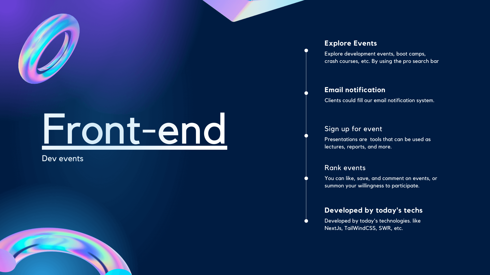

<h1 align="center" id="devs-event">
  Devs Event Front-end
</h1>

<a href="https://devevents.ir">

</a>

<div align="center">
<br/>
<a href="https://github.com/othneildrew/Best-README-Template">

</a>
<h4 align="center"><strong>A community for people interested in participating in programming events</strong></h4>
<p align="center">
  <a href="#tech-stack">Tech Stack</a> •
  <a href="#roadmap">Roadmap</a> •
  <a href="#get-started">Get Started</a> •
  <a href="#license">License</a> •
  <a href="#support">Support</a> •
  <a href="#contact">Contact</a>
</p>
<a href="https://github.com/othneildrew/Best-README-Template"><strong>Explore Back-end</strong></a> Codes
</div>

<h2 id="tech-stack">
🤖 Tech Stack
</h2>
<p>
                       
</p>

<p align="right"><a href="#devs-event">back to top</a></p>

<h2 id="roadmap">
🛣️ Roadmap
</h2>

- [x] add about page
- [ ] Add online rooms
- [ ] Additional browser support
- [ ] Add blog
    - [ ] Farsi
    - [ ] English

See the open [issues](https://github.com/devsEvent/frontend/issues) for a full list of proposed features (and known issues).

<p align="right"><a href="#devs-event">back to top</a></p>

<h2 id="get-started">
🤖 Get Started
</h2>

download zip file, or clone it using git.
```
git clone https://github.com/devsEvent/frontend.git
```

then install dependencies using

```
npm install

# or 

yarn dev
```


to setup 

```bash
npm run dev

# or

yarn dev
```
Now click this link [https://localhost:3000](https://localhost:3000)

<p align="right"><a href="#devs-event">back to top</a></p>

<h2 id="license">
⚖️ License
</h2>

<b>MIT License</b>

> See LICENSE.txt for more information.

<p align="right"><a href="#devs-event">back to top</a></p>

<h2 id="support">
💸 Support
</h2>

<a href="https://coffeebede.ir/buycoffee/vitovito">

</a>

<p align="right"><a href="#devs-event">back to top</a></p>

<h2 id="contact">
🦜 Contact
</h2>

<a href="https://twitter.com/hereisvito" target="_blank"></a>   <a href="https://www.instagram.com/vito.mohagheghian/" target="_blank"></a> <a href="https://www.instagram.com/vito.mohagheghian/" target="_blank"></a>

<p align="right"><a href="#devs-event">back to top</a></p>

